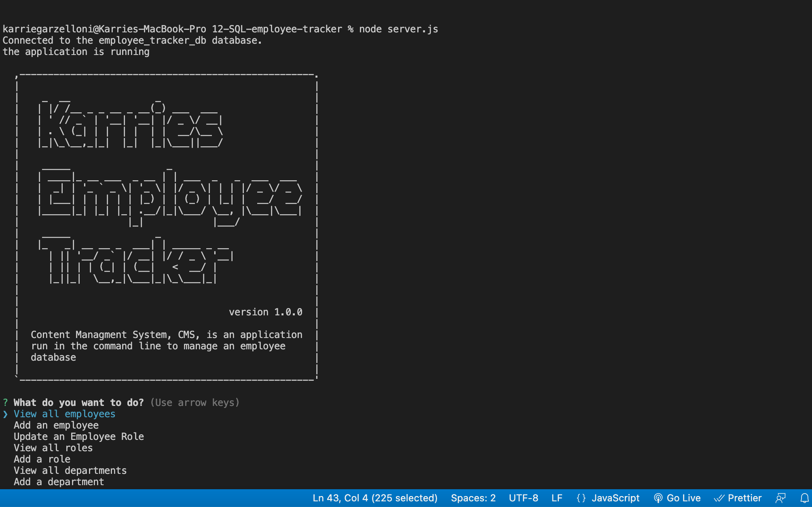

# 12 SQL: Employee Tracker 

## Developed by: Karrie Garzelloni 

## The Task
To build a command-line application from scratch to manage a company's employee database, using Node.js, Inquirer, and MySQL.

## User Story

```md
AS A business owner
I WANT to be able to view and manage the departments, roles, and employees in my company
SO THAT I can organize and plan my business
```
## Getting Started

You’ll need to use the [MySQL2 package](https://www.npmjs.com/package/mysql2) to connect to your MySQL database and perform queries, the [Inquirer package](https://www.npmjs.com/package/inquirer) to interact with the user via the command line, and the [console.table package](https://www.npmjs.com/package/console.table) to print MySQL rows to the console.

## Mock-Up

The following link show an image of initiziation of the application in the command line:


The following video shows an example of the application being used from the command line: https://watch.screencastify.com/v/5RVcp72jfgbIuDQXMfRV

## GitHub Repository 

https://github.com/kgarzelloni/12-SQL-employee-tracker


